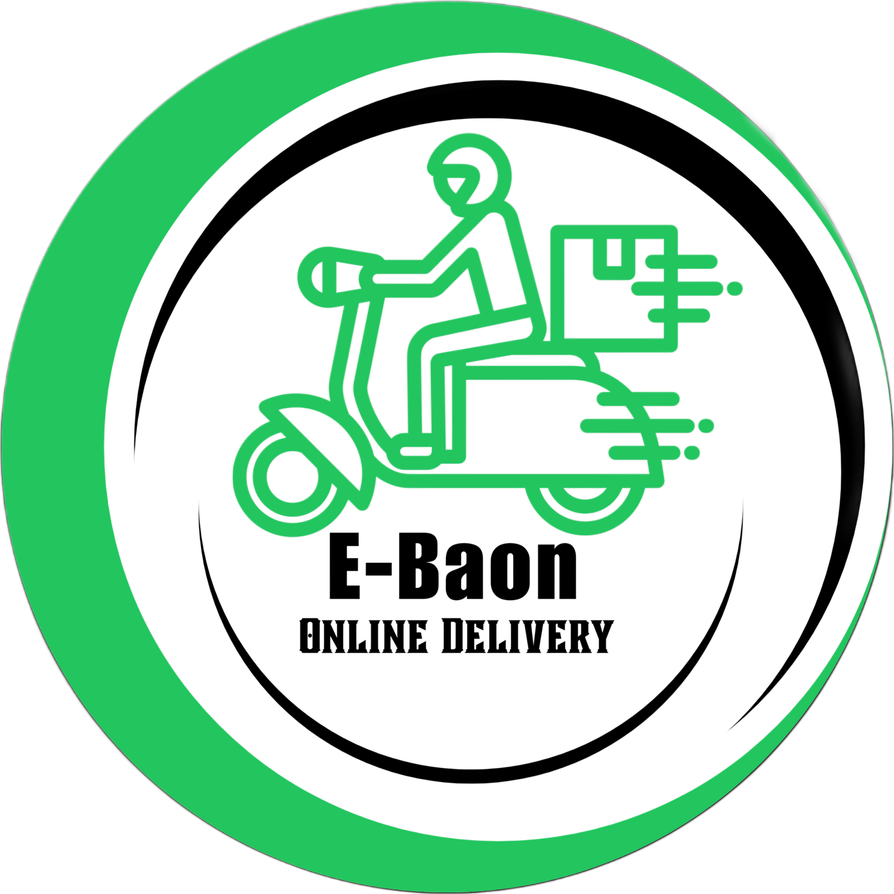

# E-Baon_Online-Delivery-System

    

The E-Baon for CSF System is a web and mobile platform for parcel pick-up and drop-off in the City of San Fernando, La Union. It enables customers to schedule deliveries and allows drivers to manage requests, offering a fast, secure, and reliable local delivery service with real-time tracking and digital transactions.

 
 

This README is available in English and Tagalog. Please expand the section for your preferred language.

---

<strong>English Version (Click to Expand)</strong>

## 🌟 Project Overview

The E-Baon for CSF System is a web and mobile platform for parcel pick-up and drop-off in the City of San Fernando, La Union. It enables customers to schedule deliveries and allows drivers to manage requests, offering fast, secure, and reliable local delivery with real-time tracking and digital transactions.

## ✨ Key Features

### For Customers (Customer View):
*   **Intuitive Product Browsing:** Homepage, categories, age-based filtering, advanced search.
*   **Detailed Product Pages:** Multiple screenshots, descriptions, reviews.
*   **Shopping Cart & Wishlist:** Add to cart, cart preview, quantity updates, coupon application, save favorites.
*   **Secure Checkout Process:** Clear steps, shipping info, order summary, "Thank You" page, invoice generation (PDF option).
*   **User Accounts:** Registration, login, (potentially) order history.
*   **Engagement & Information:** Blog, About Us, Contact page, product reviews, comment system.

### For Administrators (Admin Dashboard):
*   **Dashboard Overview:** Statistics on orders, users, sales, comments.
*   **User Management:** View and manage users.
*   **Product Management:** Add, view, edit, delete products.
*   **Order Management:** View and manage customer orders.
*   **Comment Management:** Approve, reply to comments.
*   **Content Management:** Manage blog posts, categories.
*   **Statistical Reports:** Charts for best sellers, revenue.

## 🛠️ Technology Stack

*   **Frontend:** HTML5, CSS3, JavaScript, Bootstrap, Tailwind CSS (for Admin)
*   **Backend:** PHP (Procedural or with a custom structure)
*   **Database:** MySQL (Managed via phpMyAdmin in XAMPP)
*   **Web Server:** Apache (via XAMPP)

## 🚀 Getting Started

### Prerequisites

*   **XAMPP:** Installed and running (Apache, PHP, MySQL).
*   **Git:** For cloning.

### Installation & Setup

1.  **Start XAMPP:** Ensure Apache and MySQL services are running.
2.  **Clone Repository into `htdocs`:**
    *   Navigate to your XAMPP `htdocs` directory.
    *   Run: `git clone https://github.com/AndreiOchangco/E-Baon_Online-Delivery-System.git`
    *   `cd E-Baon_Online-Delivery-System`

3.  **Database Setup:**
    *   Go to `http://localhost/phpmyadmin`.
    *   Create a new database named `e_baon` (collation `utf8mb4_general_ci`).
    *   Select `e_baon`, go to "Import", choose `E-Baon_Online-Delivery-System/Database/e_baon.sql` (or the correct path to your SQL file), and click "Go".

4.  **Configure Database Connection (if necessary):**
    *   Check your PHP database connection files.
    *   Default XAMPP credentials: Host: `localhost`, User: `root`, Password: `(empty)`, DB: `e_baon`.

5.  **Accessing the Application:**
    *   **Customer Site:** `http://localhost/Omacha-Shop_E-Commerce_Website/` (or `http://localhost/Omacha-Shop_E-Commerce_Website/Fontend/`)
    *   **Admin Panel:** `http://localhost/Omacha-Shop_E-Commerce_Website/admin/` (or your specific admin path).
        *   *Default Admin Credentials (if any):* Username: `admin`, Password: `admin` (Please update)

## 📝 License

This work is licensed under a [Creative Commons Attribution-NonCommercial 4.0 International License](https://creativecommons.org/licenses/by-nc/4.0/).
You are free to Share and Adapt the material, under the terms of Attribution and NonCommercial use.

## 👤 Contributors

*   **Team Developers**
    *   **Andrei Luise Ochangco** - Team Leader, Repository Maintainer, Software Engineer, Project Manager, Sub-UI Designer, Sub-Programmer, Dependencies Checker, Database Administrator - [@AndreiOchangco](https://github.com/AndreiOchangco)
    *   **Louis Ricardo Servito** - Main UI Designer - [@Lone-collab](https://github.com/Lone-collab)
    *   **Ardy Aquino** - Main UI Designer - 
    *   **Jonardson Ramat** - Database Manager
    *   **Mc Harley Disu** - Assistant

